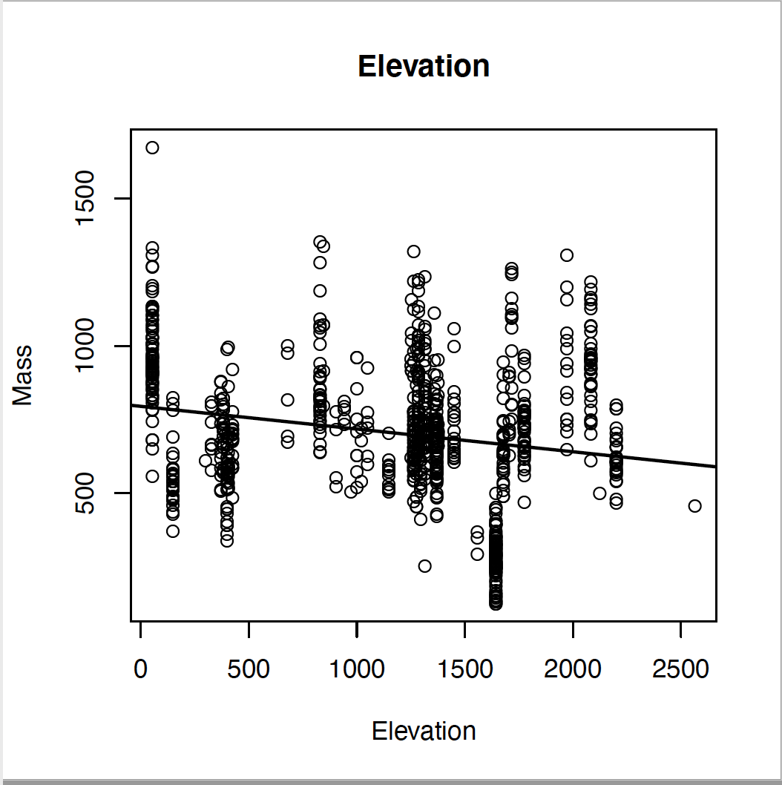
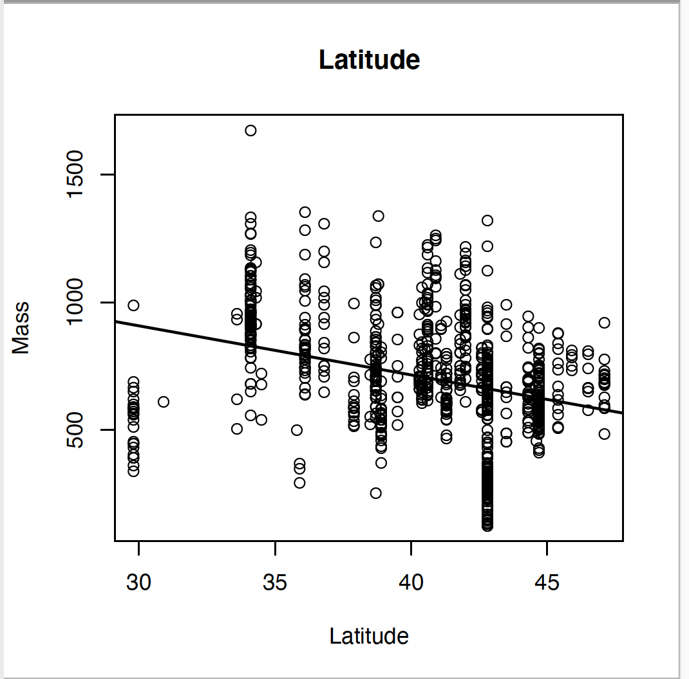
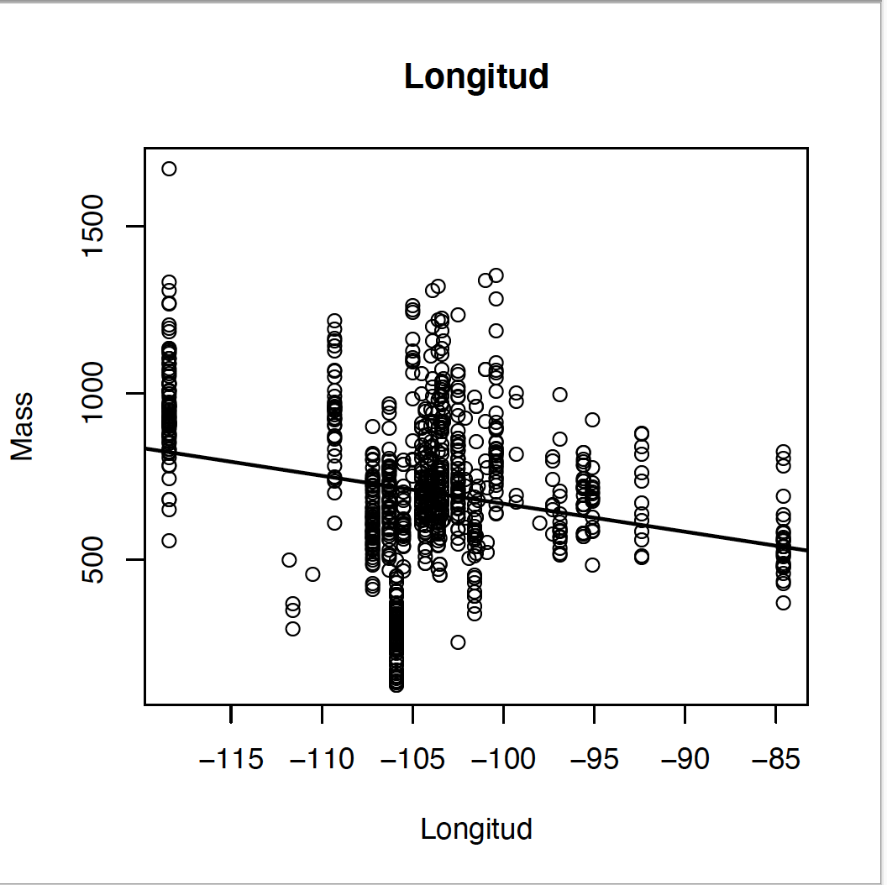
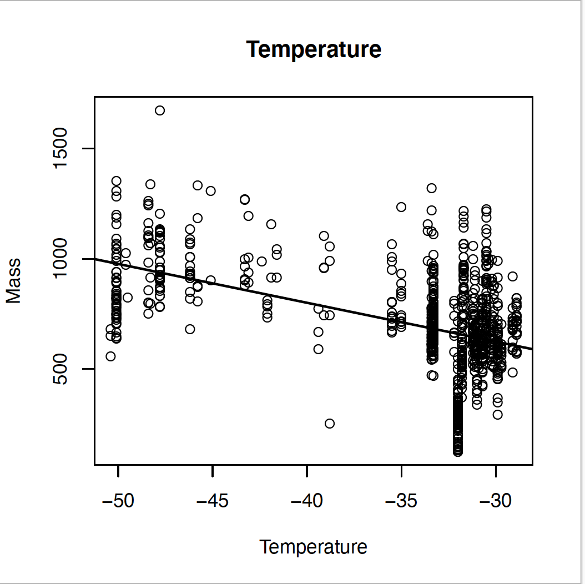

- R - BigDataChallenge

- What are the effects of geographic locations on Bison size? 

- Project for Quest- Data analysis in R class 

----------------------------TABLE OF CONTENTS----------------------------------

- Overview
- Packages downloaded
- Libraries
- Data Download 

---------------------------------OVERVIEW--------------------------------------

The following contents within this main directory include the packages, 
libraries, dataset and the workflow that is used in this analysis. 

The scripts should be run in the folling order to gain replicatory results. This also serves as our workflow.

    1. MainScript.R
    
    (Reads raw data file and creates output folders where graphs will be saved )

    2. Data.Cleaning.R
    
    (Deletes missing data points, renames columns and creates mass columns)

    3. Analysis.Graphs.R
    
    (runs regression analysis between the dependent variable (mass) and the explanatory variables, saves regrssions results, generates graphs and stores them in correct folders)

------------------------------PACKAGE DOWNLOAD---------------------------------

install.packages("tidyverse")

---------------------------------LIBRARIES-------------------------------------

library (tidyverse)

--------------------------------DATA DOWNLOAD-----------------------------------

The raw data file was originally found from:
     https://datadryad.org/stash/dataset/doi:10.5061/dryad.hp38ct1?fbclid=IwAR2T0qNARXX80OK_fTSZ2B1B3hP4Wr2rCm9BawzTMmfgRSiTTihqGu3mZPM 
     
The dataset was downloaded as a csv file. We saved the first worksheet titled Osteometrics. 

----------------------------RESULTS----------------------------------

   
